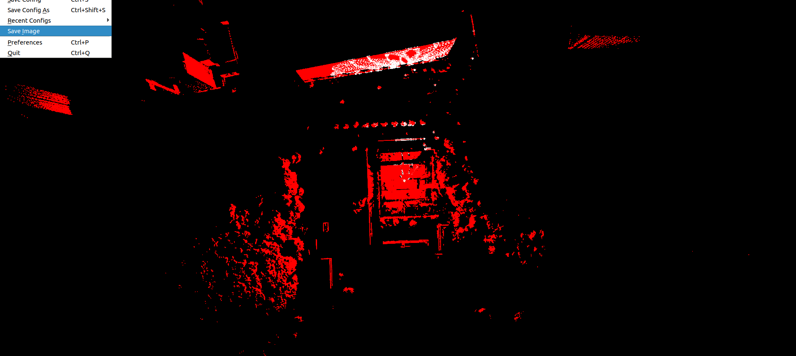
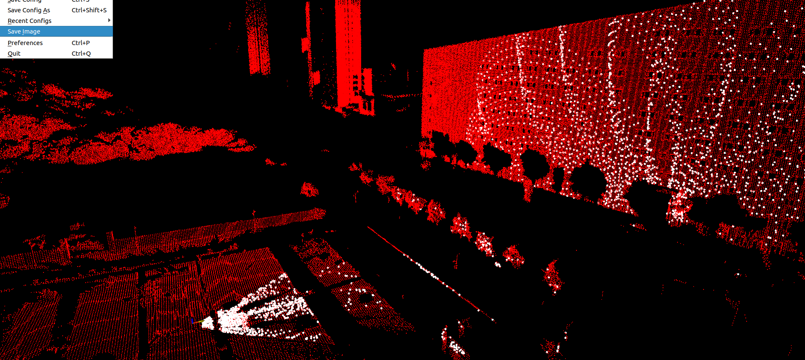

**Noted: Ubuntu 16.04 and lower is not supported**

## Trolley_relocalization

this is a simple localization script for a gargener trolley to weed based on a livox_avia lidar.

Thanks for the FAST_LIO and the livox_relocalization. This program is based on this two project.


**Developers**

**Wen Yang** from SUSTECH ISEE Lab.


<div align="center">
    
</div>

<div align="center">
    
</div>


## 1. Prerequisites
### 1.1 **Ubuntu** and **ROS**
**Ubuntu >= 18.04 (Ubuntu 16.04 is not supported)**

ROS    >= Melodic. [ROS Installation](http://wiki.ros.org/ROS/Installation)

### 1.2. **PCL && Eigen && openCV**
PCL    >= 1.8,   Follow [PCL Installation](http://www.pointclouds.org/downloads/linux.html).

Eigen  >= 3.3.4, Follow [Eigen Installation](http://eigen.tuxfamily.org/index.php?title=Main_Page).

OpenCV >= 3.2,   Follow [openCV Installation](https://opencv.org/releases/).

### 1.3. **livox_ros_driver**
Follow [livox_ros_driver Installation](https://github.com/Livox-SDK/livox_ros_driver).


## 2. Build
Clone the repository and catkin_make:

```
    cd ~/catkin_ws/src
    git clone ...
    cd ..
    catkin_make
    source devel/setup.bash
```
*Remarks:*

- If you want to use a custom build of PCL, add the following line to ~/.bashrc
```export PCL_ROOT={CUSTOM_PCL_PATH}```


## 6.Acknowledgments
Thanks for LOAM(J. Zhang and S. Singh. LOAM: Lidar Odometry and Mapping in Real-time), [Livox_Mapping](https://github.com/Livox-SDK/livox_mapping) and [Loam_Livox](https://github.com/hku-mars/loam_livox).
